# BST260 Final Project: House Price Prediction

# Our Team

# Watch Our Video on YouTube!

# Overview and Motivation

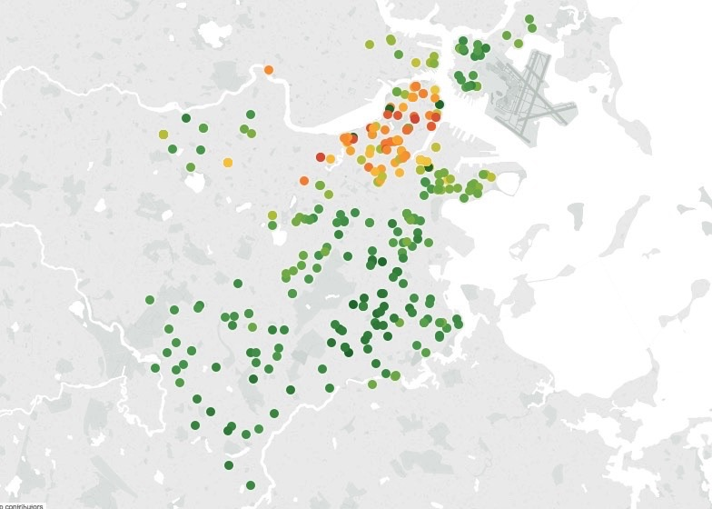

(For this demo visualization, data was provided by [Redfin](https://www.redfin.com/), a national real estate brokerage)

Growing unaffordability of housing has become one of the major challenges for metropolitan cities around the world. In order to gain a better understanding of the commercialized housing market we are currently facing, we want to figure out what are the top influential factors of the housing price. Apart from the more obvious driving forces such as the inflation and the scarcity of land, there are also a number of variables that are worth looking into. Therefore, we choose to study the house prices predicting problem on Kaggle, which enables us to dig into the variables in depth and to provide a model that could more accurately estimate home prices. In this way, people could make better decisions when it comes to home investment.

Our object is to discuss the major factors that affect housing price and make precise predictions for it. We use 79 explanatory variables including almost every aspect of residential homes in Ames, Iowa. Methods of both statistical regression models and machine learning regression models are applied and further compared according to their performance to better estimate the final price of each house. The model provides price prediction based on similar comparables of people’s dream houses, which allows both buyers and sellers to better negotiate home prices according to market trend. 

# Related Work

Here is an outline of our related work for the project.

- Exploratory Data Analysis

- Data wrangling and cleaning

- Regression, Stepwise Model Selection

- Principal Component Analysis

- Lasso Regression

- Random Forest

- Gradient Boosting

- Ensemble Learning

- Model Evaluation and Final Analysis

# Initial Questions
Through this project, we sought to answer some major questions: 

1. What are the important features that affect the house price?

2. How to build a model to predict the house price? 

3. How to evaluate our prediction performance?

It is our job to predict the sales price for each house. For each Id in the test set, we must predict the value of the SalePrice variable. 

The metric to evaluate the models is Root-Mean-Square-Error (RMSE) between the logarithm of the predicted value and the logarithm of the observed sales price. Our predictions are evaluated on Root-Mean-Squared-Error (RMSE) between the logarithm of the predicted value and the logarithm of the observed sales price.

# Our Data

Our data was obtained from [Ames Housing dataset](https://ww2.amstat.org/publications/jse/v19n3/decock.pdf), which was compiled by Dean De Cock for use in data science education. It's an incredible alternative for data scientists looking for a modernized and expanded version of the often cited Boston Housing dataset. The data includes 79 explanatory variables describing (almost) every aspect of residential homes. 

We also participated in the Kaggle Competition [House Prices: Advanced Regression Techniques](https://www.kaggle.com/c/house-prices-advanced-regression-techniques) .Our best entry for the competition is 0.1169, which leads us to 367/2636 (top 15%) in the leaderboard!

All the codes and procedures of this project can be found at [our full project repository.](https://github.com/BST260-final-group-project)

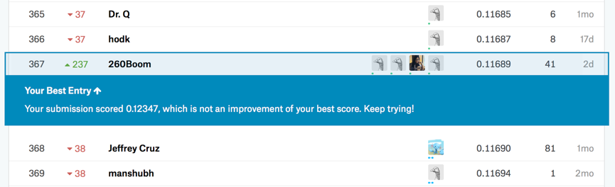

# Exploratory Data Analysis

Firstly, we do some EDAs to gain a general understanding of our data, and detecting some important matrices and trends that may come helpful for our further analysis and model building.

 
- SalesPrice vs. Living Area 

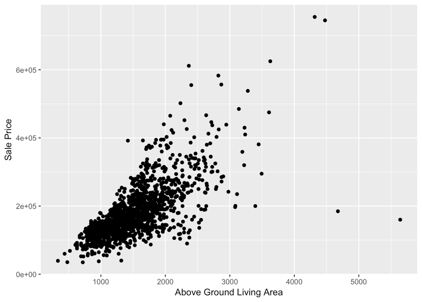

From the plot above we can see that there are two outliers which has high areas but low sale price. When fitting the models, we delete these two outliers in the training data.

- SalesPrice vs. Overall Quality

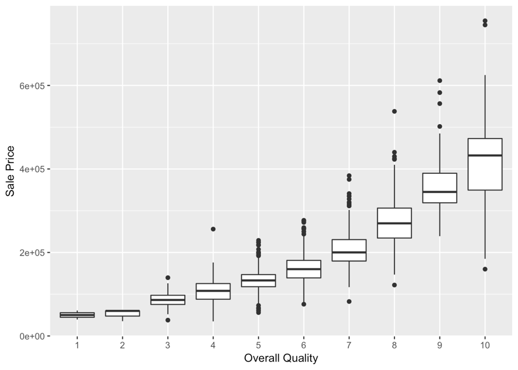

Conincided with our intuition, if the overall quality of the house is better, then the house price is higher.

- SalesPrice vs. Year Bulit

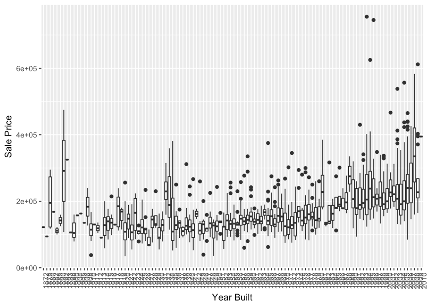

- SalesPrice vs. Year Remodel

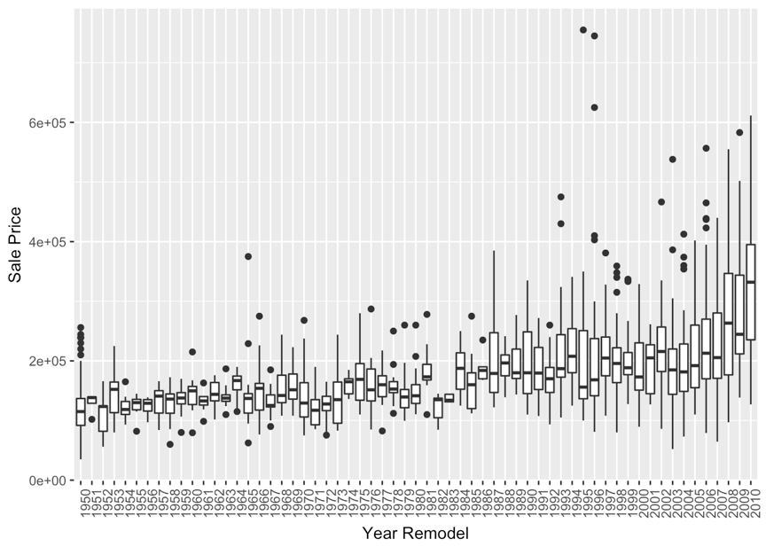

In general, the newer the house is, the higher the price is. But the correlation is not very strong.

- Correlation Matrix

Here we examined the correlations between variables and correlations with our outcome of interest: SalePrice.

correlations between variables:

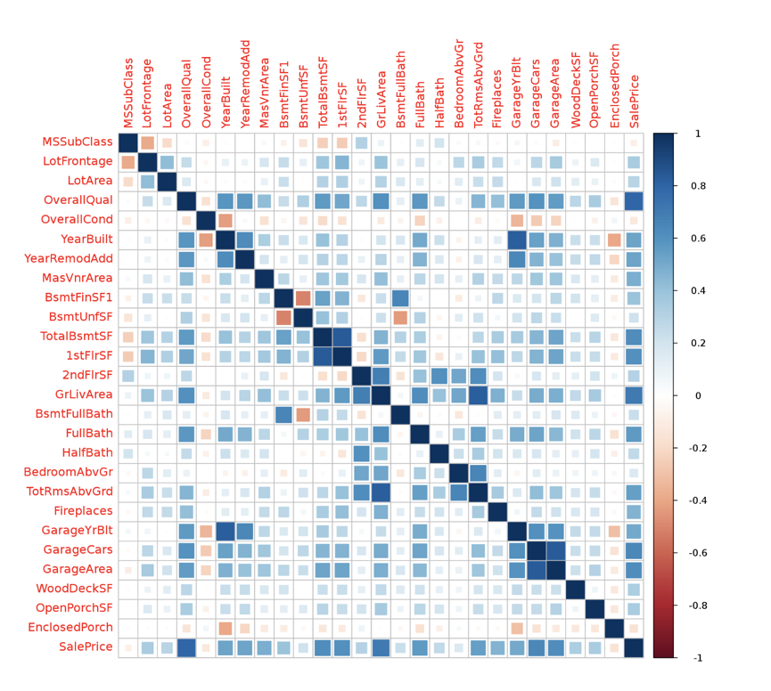
Figure: Correlation visualization with R packages(corrplot, ggplot2)

Correlations with SalePrice:
Here we use the R package tabplots to find strong-related variables to "Saleprice" among 79 variables, which would further help us do feature selection and engineering. 

Here are some of the plots we generated with R package tabplots to show the number and range of values for each variable as well as the covariance among the variables:

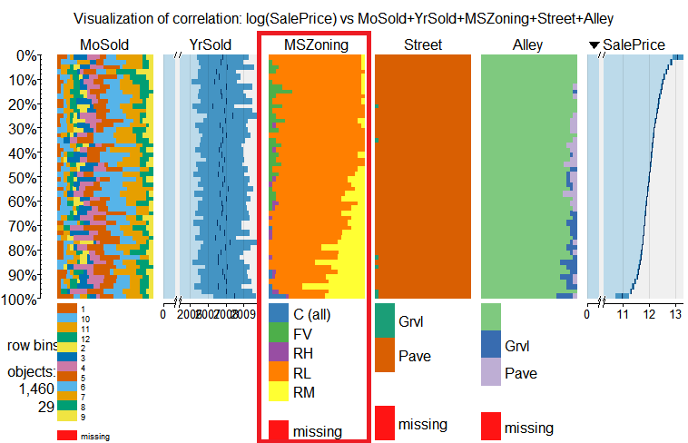
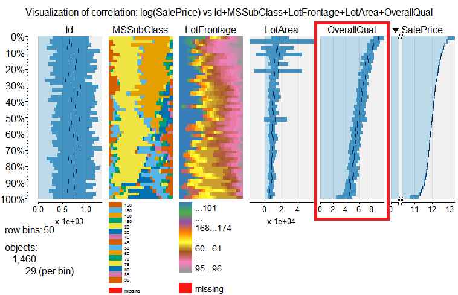

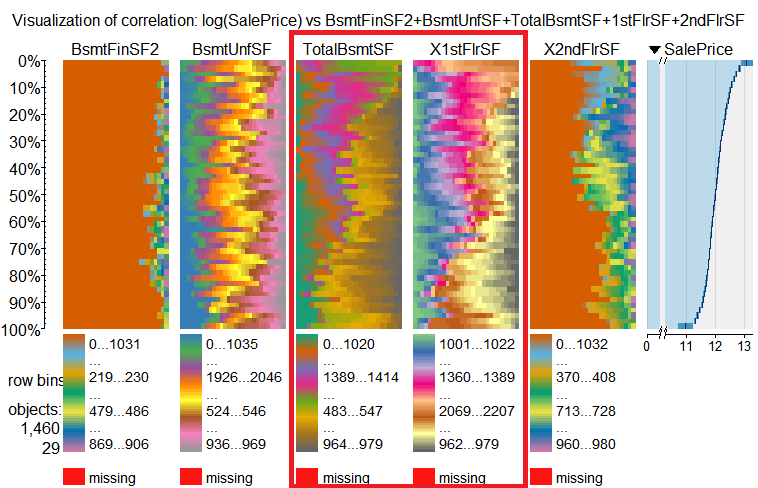
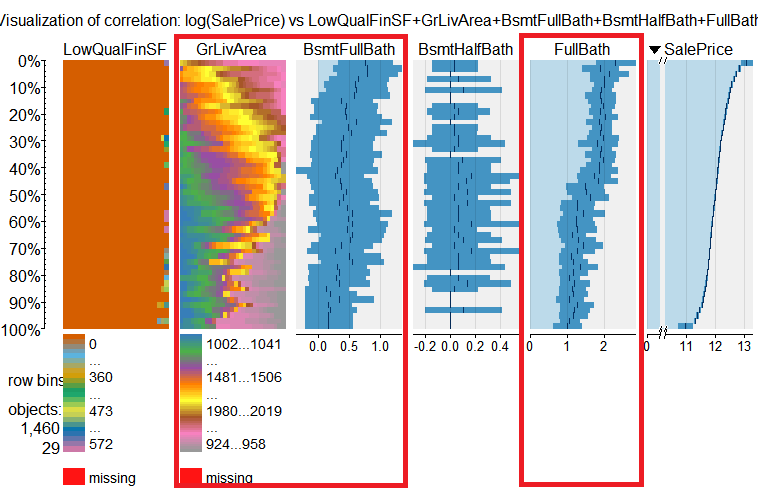

Of all numeric variables, Variables strongly correlated with hourse price (SalePrice) are:
 OverallQual, YearBuilt, YearRemodAdd, MasvnrArea, BsmtFinSF1, TotalBsmtSF, 1stFlrSF, GrLiveArea, FullBath, TotRmsAbvGrd, FirePlaces, GarageYrBlt, GarageCars, GarageArea, WoodDeskSF and OpenPorchSF
Which is consistent with our findings in the head map below:
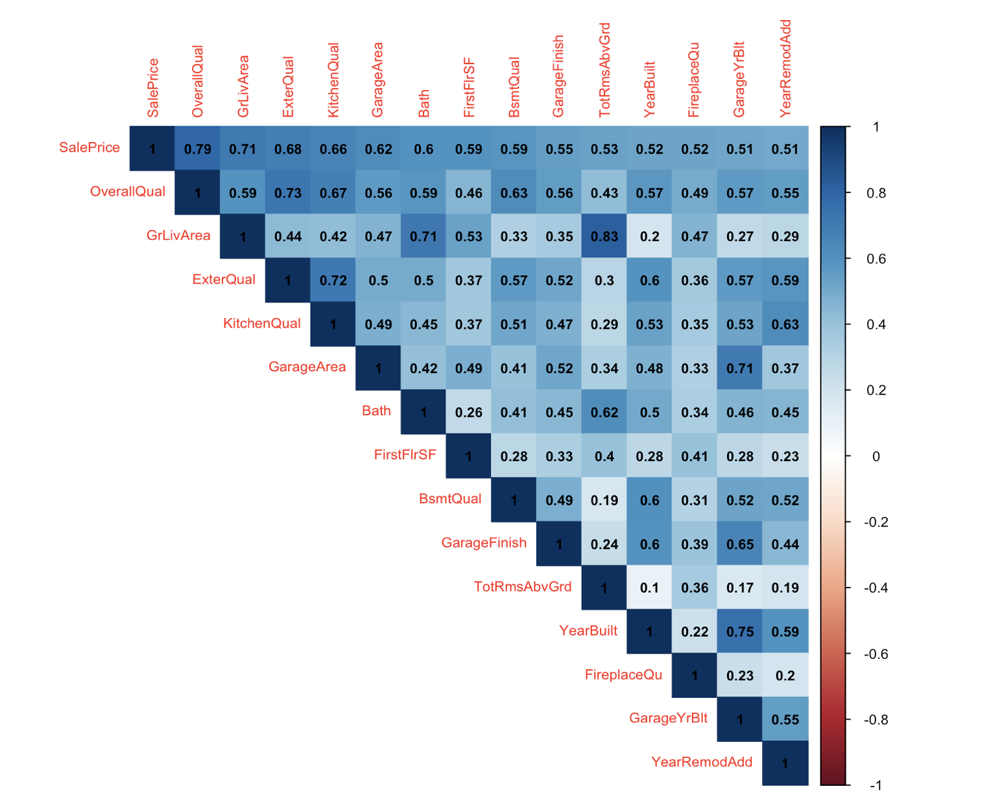
 
# Data Cleaning and Feature Engineering
 
Before we rush into regression and machine learning prediction, it is very important to get our data "cleaned" enough. This process usually take 80% of time in a real-world data problem. In fact, in our project, we spend about 60% of our time cleaning the data ourselves! 

- Missing Data and Different Data Types

When using the data, we must be careful about the following variables:

Ordinal feature: ExterCond, ExterQual, Fence, FireplaceQu, Functional, GarageFinish, GarageQual, HeatingQC, KitchenQual, OverallCond, OverallQual, BsmtCond, BsmtQual, BsmtExposure, BsmtFinType1, BsmtFinType2, GarageCond, PavedDrive

Read as numerial but actually is categorical: MoSold, MSSubClass

- Filling NAs and scale the data

There are, indeed, a lot of NAs in our oringinal dataset, which we need to clean the dataset and fill in the NA with appropriate value to make our prediction. Then, we try to fill the NAs by using their properties according to the value in those columns.

First, for the columns contain large percentage of NAs, we may remove the columns or combine them with other columns and we fill in the missing value with “none”.

PoolQC(2909/2919=99.66%) MiscFeature(2814/2919=96.4%) Alley(2721/2919=93.22%)

Then, we will deal with the other columns which contain NAs by replacing the missing values according to the strong correlation within those columns and determine the value we should fill in.

1.For columns like Fence, FireplaceQu, BsmtCond, BsmtExposure, BsmtFinType2, BsmtFinType1, BsmtFinSF2 and BsmtQual, the NA is meaningful, thus, we see these NAs as no fence, no fireplace, no Basement, and when we transform these categorical data into numeric ones, we set these NAs as 0.

2.GarageQual and GarageCond, which highly correlated, we keep GarageQual and remove GarageCond, and then transform into numeric data

3.GarageYrBlt:159 NAs, except one outlier(2207), which we deal with a typo, and change that to ‘2007’(“YearBuilt” = 2006); others, we saw those as the very original ones which maybe built earlier than the data can be reached, Min-1 = 1894

4.For Exterior1st and Exterior2nd, which only contain 1 missing value and there aren’t any other features that can help us determine what value we should fill in the NAs, therefore, we replace NAs in these two columns with ‘Other’.

5.In the columns that with only few missing values, we can replace the missing value with median, mean or mode value from each column. 

Third, after filling in the missing value of our original dataset, we can also combine some columns and transform ordinal feature into numeric to make better prediction, which can solve our initial objectives of our project.

1.combine bath= full bath + half bath

2.Transform ordinal feature, such as ExterCond, ExterQual, Functional, GarageFinish, GarageQual, HeatingQC, KitchenQual, OverallCond, OverallQual, BsmtCond, BsmtQual, BsmtExposure, BsmtFinType1, BsmtFinType2, GarageCond, PavedDrive to numeric data

3.Also, some columns in our dataset such as MoSold and MSSubClassRead, they are read as numerical but actually are categorical.

Finally, we use one-hot method to deal with categorical features excluding ordinal ones. For example, there are two possible values - “Grvl” and “Pave” - for the feature “Street”. In the new dataframe, we create two new columns “Street_Grvl” and “Street_Pave”, and delete the old column “Street”. If the observation’s value for “Street” is “Grvl” in the old dataframe, then in the new dataframe “Street_Grvl” is set to 1 and “Street_Pave” is set to 0.

 
 
- Model Selections

Stepwise Selection combines elements of both forward selection and backward elimination, allow us either to remove covariates from our previous model or add back in covariates that we had previously eliminated from our model, and in this sense, giving us chances to consider all possible subsets of the pool of explanatory variables and find the model that best fits the data according to some prespecified criterion, such as AIC(Akaike Information Criterion), BIC(Bayesian Information Criterion), and adjusted R square.[]

- Lowess Anlaysis

LOWESS (Locally Weighted Scatterplot Smoothing), or LOESS (Locally Weighted Smoothing), is often applied in regression analysis that creates a smooth line through a scatter plot. It is especially helpful when detecting nonlinear relationship between variables and predicting trends. In our study, LOWESS was first used to detect potential nonlinear associations between variables and sale prices. Since it performed the best results compared to other smoothing methods, we then used it to predict prices after PCA preprocessing.

- Principal component analysis

Principal component analysis (PCA) is a statistical procedure that uses an orthogonal transformation to convert a set of observations of possibly correlated variables into a set of values of linearly uncorrelated variables called principal components.

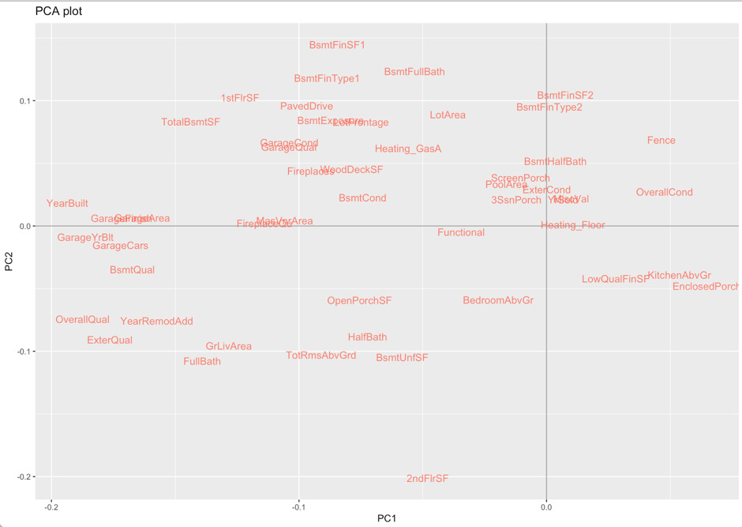

We also run PCA on our data sets. PC1 and PC2 represent 1st principal component and 2ed principal component. Top 50 features with the most meaningful effects were chosen in the plot, where distances between covariates suggest their degrees of correlation. We can see some patterns in the projection plot: garage condition is correlated with garage quality; fireplace is correlated with wood deck area.

As mentioned in class, we can’t estimate the estimators of a high-dimensional nonlinear model via lm function. So we applied PCA to estimate predictors by minimizing the squared error of the approximation.

- Lasso Regression

Lasso (Least Absolute Shrinkage and Selection Operator) regression is a regularized linear regression. It uses L1 norm to constrain the coefficients of the fitting model. Usually, some coefficients will be set to 0 under the constrain. Therefore, the lasso regression is more robust compared to ordinary linear regression.

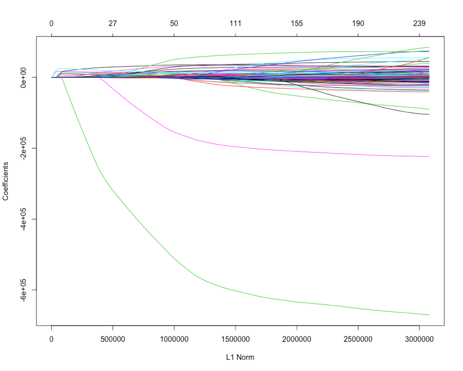

# Machine Learning

- Random Forest

Random forest is an ensembling machine learning method basing on classification tree or regression tree. In general, random forest will generate many decision trees and average their predictions to make the final prediction. When generating each decision tree, the random forest will use a subset of all features, which avoids the overfitting problem.

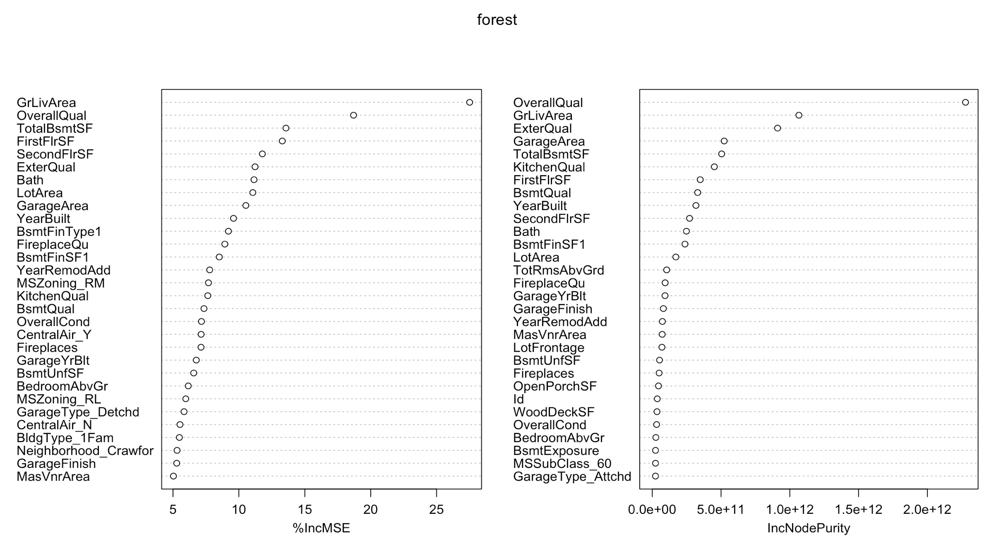

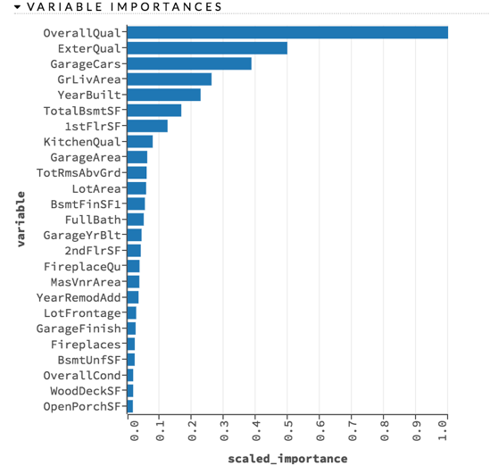
- Regression Tree 

The regression tree is a good friend to help us decide which features matter when buying houses. Here is am example of regression tree:
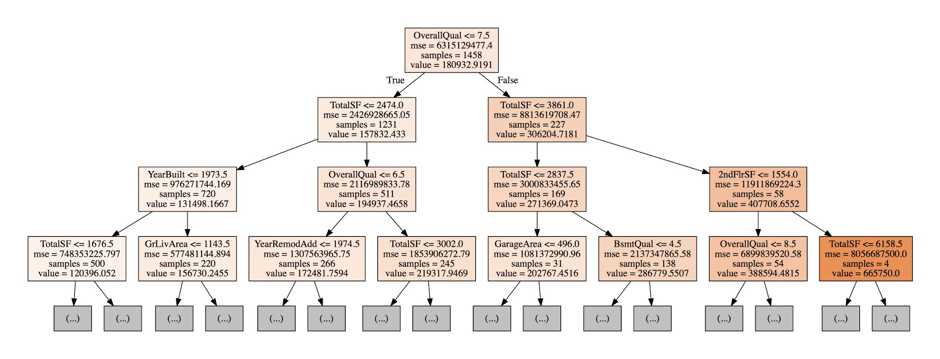

To our surprise, the overall quality of the house is more important than the total square feet. 
The year when the house was built or remodeled also plays an important role in pricing. This coincide with our intuition since the year is related to the quality.

- Gradient Boosting

Similar to random forest, gradient boosting is another ensembling machine learning method basing on classification tree or regression tree. While in random forest every tree is weighted the same, every tree in gradient boosting tries to minimize the error between target and trees built previously. Gradient boosting is now a popular machine learning framework for both academia and industry.
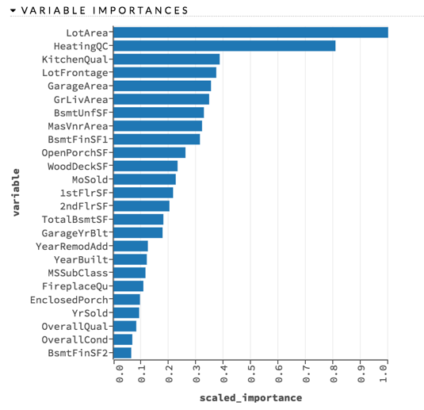

- Ensemble Methods

Ensemble learning combines multiple statistical and machine learning algorithms together to achieve better predictive performance than any algorithm alone, because the errors in each model may cancel out in the ensembled model. In our project, we will try to ensemble the regression techniques we use (e.g. lasso regression, gradient boosting), to predict the sale prices and compare the ensembled model with other models.

In our project, we just simply stack several models, i.e. average their predictions to make our final prediction.

# Final Analysis

Our goal is to minimize the RMSE after log transformation, so when training the model, the target value is the logarithm of the observed sales price. Besides, we add one more feature - total square feet “TotalSF”, which is defined as TotalSF = TotalBsmtSF + 1stFlrSF + 2ndFlrSF.

Some models (e.g. linear models) perform better when the predictors are “normal”. Therefore we use Box-Cox transformation to transform the features of which skewness is high. 

- Some Important Matrices

In our model, we can easily find that housing price realted a lot of factors, some of these factors are listed in the circle above. To be specific, overall quality increase 1, the house price would increase 8762, and when GrLiveArea(Above grade (ground) living area square feet) increase 1, the housing price would increase a lot, which can be 58249; on the other hand, when the house near the rail road, the housing price will decrease 11403, these all meet our intuitive knowledge. We have a little visualization of those important matrices as follows:

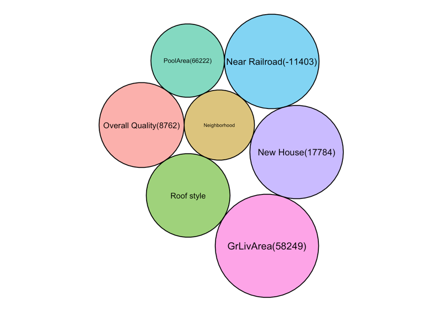

- Model Evaluations

We use 5-fold cross validation to evaluate how each model performs. Each model’s RMSEs in cross validation (CV) and in leaderboard (LB) are as follows:

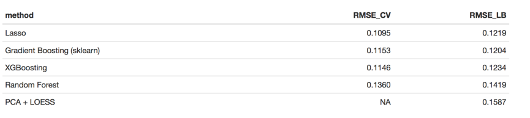

Alough lasso performs best in cross validation, but gradient boosting model provided by sk-learn is better in leader board. We think that it comes from the overfitting problem of lasso regression. In both cross validation and leaderboard, the random forest does not perform well. In this test, random forest avoid the problem of overfitting, but it underfits the data at the same time. The “PCA + LOESS” model performs worst, since LOESS model is not a good model for complex regression problem.

- Ensemble Methods and Kaggle

Based on the above result, we choose two models - lasso and gradient boosting in sklearn, and average their predictions to make our final prediction. The RMSE of the stacking model is 0.1169, which leads us to 367/2636 (top 15%) in the leaderboard.

Code can be found on: https://github.com/BST260-final-group-project/project-files/tree/master/final-analysis

# Source
- The Source of Data is from [Ames Housing dataset](https://ww2.amstat.org/publications/jse/v19n3/decock.pdf)
- The Github page of our full project repository. All the codes and procedures can be found [here](https://github.com/BST260-final-group-project)

