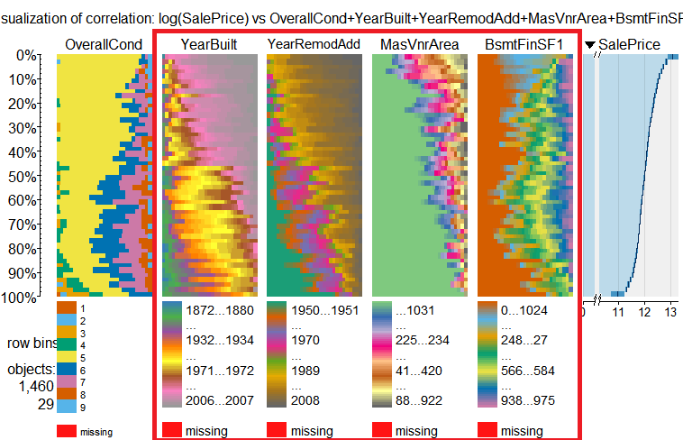
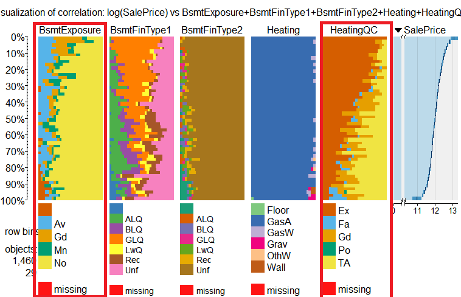
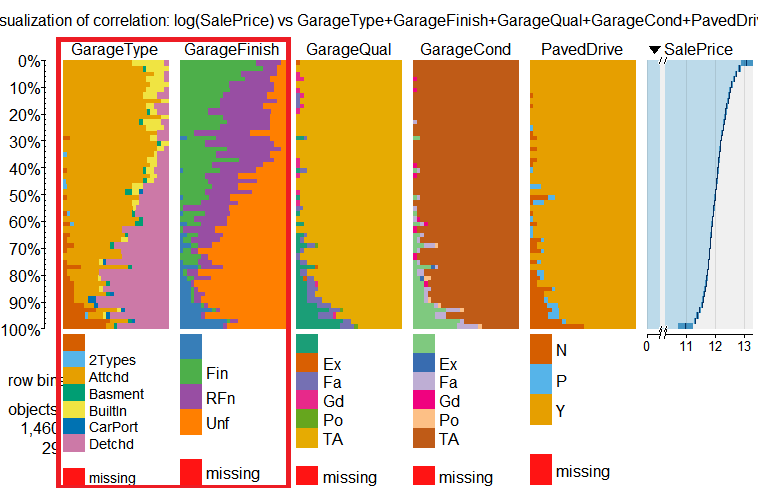

# BST260 Final Project: House Price Prediction


Jian Kang,
Chi Zhang,
Hanyu Jiang,
Jiajing Chen  


(Data provided by [Redfin](https://www.redfin.com/), a national real estate brokerage.)

# Overview and Motivation

Growing unaffordability of housing has become one of the major challenges for metropolitan cities around the world. In order to gain a better understanding of the commercialized housing market we are currently facing, we want to figure out what are the top influential factors of the housing price. Apart from the more obvious driving forces such as the inflation and the scarcity of land, there are also a number of variables that are worth looking into. Therefore, we choose to study the house prices predicting problem on Kaggle, which enables us to dig into the variables in depth and to provide a model that could more accurately estimate home prices. In this way, people could make better decisions when it comes to home investment.

Our object is to discuss the major factors that affect housing price and make precise predictions for it. We use 79 explanatory variables including almost every aspect of residential homes in Ames, Iowa. Methods of both statistical regression models and machine learning regression models are applied and further compared according to their performance to better estimate the final price of each house. The model provides price prediction based on similar comparables of people’s dream houses, which allows both buyers and sellers to better negotiate home prices according to market trend. 


# Related Work

- Stepwise
- PCA
- Random Forest
- Gradient Boosting
- (Ensemble Learning)
- Some kernal in Kaggle


# Initial Questions
Through this project, we sought to answer some major questions: 
1.
2. Our main goal 

It is our job to predict the sales price for each house. For each Id in the test set, you must predict the value of the SalePrice variable. 

3. How to evaluate our prediction performance?

Our predictions are evaluated on Root-Mean-Squared-Error (RMSE) between the logarithm of the predicted value and the logarithm of the observed sales price.


# Data: Source, scraping method, cleanup, etc.

- Source

Our data was obtained from [Ames Housing dataset](https://ww2.amstat.org/publications/jse/v19n3/decock.pdf), which was compiled by Dean De Cock for use in data science education. It's an incredible alternative for data scientists looking for a modernized and expanded version of the often cited Boston Housing dataset. 

We also participated in the Kaggle Competition [House Prices: Advanced Regression Techniques](https://www.kaggle.com/c/house-prices-advanced-regression-techniques) 

The data includes 79 explanatory variables describing (almost) every aspect of residential homes. 

- Data Cleaning

1. Missing Data and Different Data Types

When using the data, be careful about the following variables:

Ordinal feature: ExterCond, ExterQual, Fence, FireplaceQu, Functional, GarageFinish, GarageQual, HeatingQC, KitchenQual, OverallCond, OverallQual, BsmtCond, BsmtQual, BsmtExposure, BsmtFinType1, BsmtFinType2, GarageCond, PavedDrive

Read as numerial but actually is categorical: MoSold, MSSubClass

2. filling NAs and scale the data


# Exploratory Analysis
- Correlations

Here we examined the correlations between variables and correlations with our outcome of interest: SalePrice.

correlations between variables:


Figure: Correlation visualization with R packages(corrplot, ggplot2)

Correlations with SalePrice:
Here we use the R package tabplots to find strong-related variables to "Saleprice" among 79 variables, which would further help us do feature selection and engineering. 

Here are some of the plots generated with R package tabplots to show the number and range of values for each variable as well as the covariance among the variables:








Of all numeric variables, Variables strongly correlated with hourse price (SalePrice) are:
 OverallQual, YearBuilt, YearRemodAdd, MasvnrArea, BsmtFinSF1, TotalBsmtSF, 1stFlrSF, GrLiveArea, FullBath, TotRmsAbvGrd, FirePlaces, GarageYrBlt, GarageCars, GarageArea, WoodDeskSF and OpenPorchSF
 
- Stepwise selections

- Principal component analysis

Principal component analysis (PCA) is a statistical procedure that uses an orthogonal transformation to convert a set of observations of possibly correlated variables into a set of values of linearly uncorrelated variables called principal components [1].
As mentioned in class, we can’t estimate the estimators of a high-dimensional nonlinear model via lm function. So we applied PCA to estimate predictors by minimizing  the squared error of the approximation.


- etc

# Feature Engineering


# Machine Learning
- XGBoost


- Random Forest


- Regression Tree 

The regression tree is a good friend to help us decide which features matter when buying houses. Here is am example of regression tree:


To our surprise, the overall quality of the house is more important than the total square feet. 
The year when the house was built or remodeled also plays an important role in pricing. This coincide with our intuition since the year is related to the quality.

- Ensemble Methods

# Final Analysis


- Bulleted
- List

1. Numbered
2. List

**Bold** and _Italic_ and `Code` text

[Link](url) and 
```
